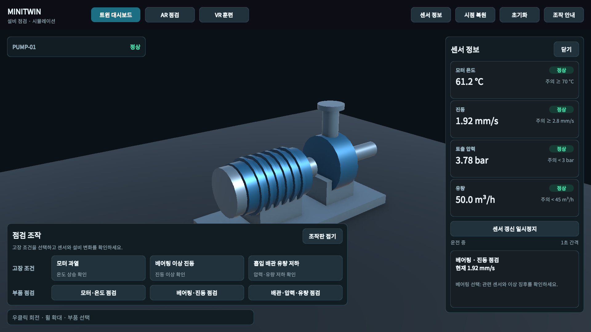
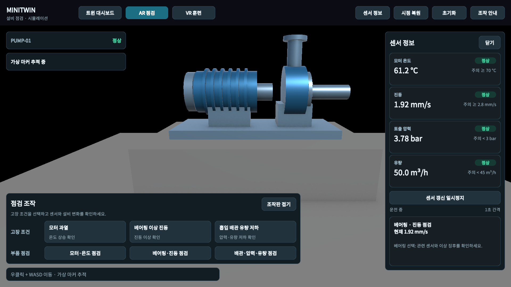
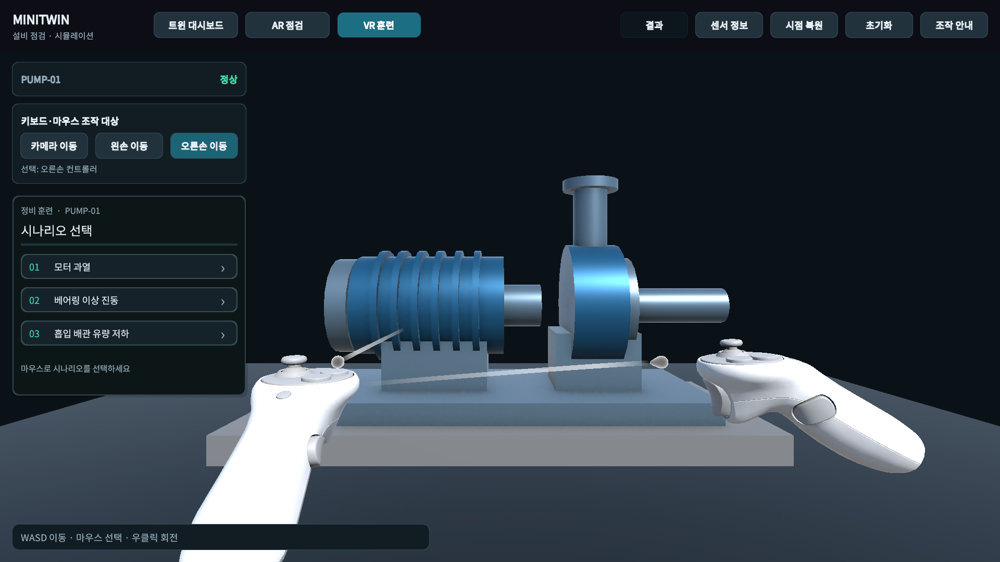
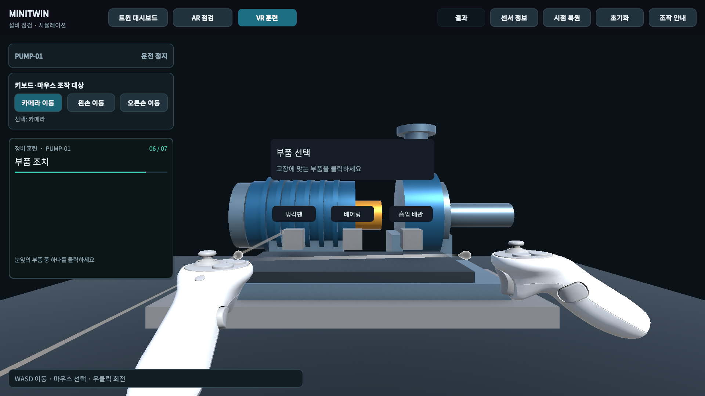
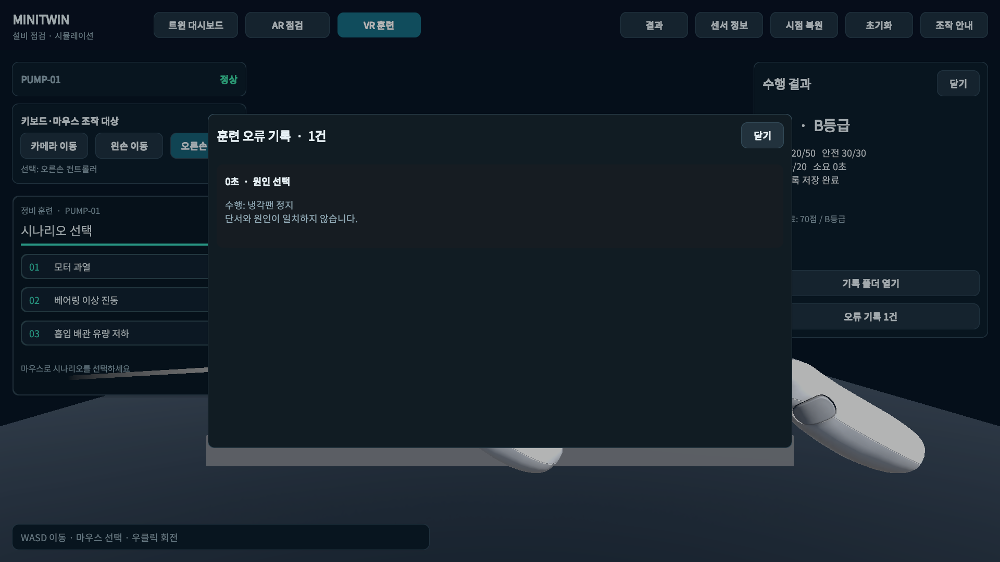

# MiniTwin

Unity로 만든 **설비 상태 모니터링·AR 점검·VR 정비 훈련 프로토타입**입니다. 가상 펌프의 센서와 고장 상태를 확인하고, 정비 절차를 수행한 뒤 점수와 오류 기록을 저장합니다.

## 실행 범위

| 모드 | 주요 기능 | 실행 환경 |
| --- | --- | --- |
| 트윈 대시보드 | 펌프·센서 시각화, 고장 주입, 부품 점검 | Unity Editor / Windows 빌드 |
| AR 점검 | 가상 이미지 추적, 마커 기준 모델 배치, 센서 확인 | Unity Editor의 XR Simulation |
| VR 훈련 | 가상 컨트롤러 선택, 단계별 정비, 평가·기록 | Unity Editor의 XR Interaction Simulator |

물리 장비 없이 Windows PC의 키보드·마우스로 제작하고 시연한 프로젝트입니다. 센서 값과 판정 임계값은 시연용 가상 데이터입니다. 실제 설비 연결, 실시간 IoT 연동, 스마트폰 AR 및 VR 헤드셋 동작은 검증하지 않았습니다. Windows 실행 파일에서는 대시보드를 사용하며, AR·VR 모드는 Editor에서 실행합니다.

## 주요 기능

### 설비 상태 모니터링



- 모터 온도, 진동, 토출 압력, 유량을 1초 간격으로 생성하고 최근 60개 값을 보관합니다.
- 정상·주의·위험·정지·미확인 상태를 구분합니다. 센서 갱신이 3초를 초과해 중단되거나 값이 유효하지 않으면 미확인 상태로 처리합니다.
- 모터 과열, 베어링 이상 진동, 흡입 배관 유량 저하의 세 고장 시나리오를 주입합니다.
- 부품 선택 시 해당 센서와 점검 단서를 표시합니다. 초기화하면 같은 seed로 시뮬레이션을 다시 시작합니다.

### AR 점검



- AR Foundation의 가상 이미지 추적으로 펌프를 배치합니다.
- 최초 추적 이후 마커가 보이지 않으면 마지막 확인 위치를 유지하고 추적 소실 상태를 표시합니다.
- 마커를 다시 감지하면 모델 위치를 갱신합니다. 추적이 끊긴 동안 새 위치를 추정하는 기능은 아닙니다.

### VR 정비 훈련



1. 보호구 확인
2. 부품·센서 점검
3. 원인 선택
4. 설비 정지
5. 차단 확인
6. 부품 조치
7. 재가동

현재 단계에 필요한 조작을 훈련판에 표시합니다. 잘못된 순서의 조치와 오답은 진행을 막고 기록합니다. 부품 조치 단계에서는 눈앞의 부품 또는 이름표를 선택하며, 정답이면 재가동 단계로 진행합니다.



완료 시 정확도 50점·안전 30점·시간 20점으로 평가합니다. 결과에는 점수·등급·소요 시간과 오류 당시의 단계·행동·센서 값이 포함됩니다. 이 평가는 프로토타입의 훈련 규칙이며 실제 안전 인증 기준이 아닙니다.

## 개발 환경

| 항목 | 버전 |
| --- | --- |
| Unity Editor | **6000.3.13f1** |
| Universal Render Pipeline | 17.3.0 |
| Input System | 1.19.0 |
| AR Foundation | 6.6.2 |
| XR Interaction Toolkit | 3.6.1 |

정확한 의존성은 [manifest.json](Packages/manifest.json)과 [packages-lock.json](Packages/packages-lock.json)에 고정되어 있습니다. 패키지 복원을 위해 인터넷과 Git이 필요합니다.

## 시작하기

```bash
git clone https://github.com/syh8775/MiniTwin.git
```

1. Unity Hub에서 복제한 `MiniTwin` 폴더를 프로젝트로 추가합니다.
2. **Unity 6000.3.13f1**로 열고 패키지 복원·에셋 임포트가 끝날 때까지 기다립니다.
3. `Assets/MiniTwin/Scenes/Dashboard.unity`를 열고 Play를 누릅니다.
4. 상단의 **트윈 대시보드 / AR 점검 / VR 훈련**으로 모드를 전환합니다. AR·VR 씬을 직접 열어 실행할 수도 있습니다.
5. Game 뷰를 클릭해 입력 포커스를 주고 **조작 안내**를 확인합니다.

씬과 필요한 SDK 샘플은 저장소에 포함되어 있습니다. `MiniTwin > Build prototype scenes` 메뉴는 MiniTwin 씬 3개와 관련 설정을 다시 만드는 제작 도구이므로, 일반 실행에는 필요하지 않습니다.

### 조작

| 모드 | 조작 |
| --- | --- |
| 대시보드 | 마우스로 부품·버튼 선택, 우클릭 드래그로 회전, 휠로 확대 |
| AR | 우클릭을 누른 채 WASD로 가상 카메라 이동, **시점 복원**으로 초기 위치 복귀 |
| VR | **카메라 이동 / 왼손 이동 / 오른손 이동**으로 대상 선택, WASD 이동, 마우스로 3D 훈련판·부품 선택 |

### Windows 빌드

Unity의 Windows Build Profile에서 `Dashboard` 씬이 첫 번째인지 확인하고 빌드합니다. 저장소의 씬 목록은 Dashboard·AR·VR 순서이며, 빌드 실행 중 AR·VR 전환은 Editor 시연 범위에 맞춰 제한됩니다. 로컬 빌드 결과는 Git에서 제외되어 있습니다.

### 훈련 기록



결과는 `Application.persistentDataPath/TrainingRecords`에 JSON으로 저장됩니다. 기본 Windows 위치는 다음과 같습니다.

```text
%USERPROFILE%/AppData/LocalLow/ShinYohan/MiniTwin/TrainingRecords
```

완료 후 결과 패널에서 기록 폴더와 오류 목록을 확인할 수 있습니다.

## 코드 구조

| 파일 | 역할 |
| --- | --- |
| [MiniTwinCore.cs](Assets/MiniTwin/Scripts/MiniTwinCore.cs) | 센서 생성, 공유 상태, 훈련 단계·점수·오류 기록, JSON 저장 |
| [PumpThresholds.cs](Assets/MiniTwin/Scripts/PumpThresholds.cs) | ScriptableObject 기반 센서 임계값과 상태 판정 |
| [MiniTwinApp.cs](Assets/MiniTwin/Scripts/MiniTwinApp.cs) | 모드 전환, 공유 코어 연결, XR 선택과 입력 처리 |
| [MiniTwinApp.UI.cs](Assets/MiniTwin/Scripts/MiniTwinApp.UI.cs) | 화면 UI 생성·갱신, 센서·도움말·결과 패널 |
| [MiniTwinAR.cs](Assets/MiniTwin/Scripts/MiniTwinAR.cs) | 가상 이미지 추적과 추적 소실·복구 처리 |
| [PumpView.cs](Assets/MiniTwin/Scripts/PumpView.cs) | 펌프 모델 표현과 부품 선택 |
| [SensorGraph.cs](Assets/MiniTwin/Scripts/SensorGraph.cs) | 센서 이력 그래프 |
| [MiniTwinQA.cs](Assets/MiniTwin/Editor/MiniTwinQA.cs) | 경계값·안전 차단·훈련·저장 핵심 검사 |
| [MiniTwinBuilder.cs](Assets/MiniTwin/Editor/MiniTwinBuilder.cs) | 전용 씬·XR 설정 생성 도구 |

세 모드는 같은 `MiniTwinCore`를 참조하고 `Changed` 이벤트로 표시를 갱신합니다. 공통 UI 치수와 배치 기준은 [UI_LAYOUT.md](UI_LAYOUT.md)에 정리했습니다.

## 주요 문제 해결

| 발생한 문제 | 처리 방식 |
| --- | --- |
| 안내 문구와 버튼 이름·위치 불일치 | 같은 단계 이름 사용, 현재 단계 조작 표시, 단일 VR 훈련판으로 통합 |
| 측면 이동 시 AR 모델 소실 | 마지막 추적 위치 유지, 소실 상태 안내와 재감지 시 위치 갱신 |
| 먼 부품을 운반해 소켓에 넣는 조작이 불편 | 카메라 앞 부품 클릭 선택, 정답 진행·오답 유지와 기록 |
| 관리 화면 구성으로 3D 조작 공간이 좁아짐 | 전체 화면 카메라와 필요할 때 여는 보조 패널로 변경 |
| 색·폰트 외의 크기와 항목 배치가 제각각 | 치수 기준 문서화 후 버튼·패널·간격·글자 역할 통일 |

## 검증 상태

2026.10.09 기준 제작 환경에서 확인한 결과입니다.

- 핵심 로직 검사 63개: 센서 경계값, 데이터 유효성, 안전 차단, 세 훈련 시나리오와 JSON 저장
- 최종 UI 포인터 이벤트 29회, XR SDK 선택 32회
- 세 고장 시나리오 완료, 오답 후 단계 유지와 정답 진행, 부품·이름표 레이캐스트 확인
- 공통 UI 치수·글자 높이·글리프 검사 이상 0건
- Windows 대시보드 빌드 성공

자동 선택 검사는 Editor의 UI 이벤트·XR SDK 선택 API를 이용한 결과입니다. 실제 사용 피드백과 함께 검토했으며, 실기기 시험 결과와 구분합니다. GitHub Actions CI는 아직 구성하지 않았습니다.

핵심 검사 소스의 진입점은 `MiniTwin.Editor.MiniTwinQA.Run()`입니다. Editor 코드 실행 환경에서 호출하면 검사 요약을 반환하고 로컬 `QA/core-checks.json`을 생성합니다. 화면·XR 상호작용 검사는 별도로 수행했습니다. 로컬 QA 결과·캡처·빌드는 저장소에 포함하지 않습니다.

## 포함 자료의 라이선스

- **Noto Sans KR**: [SIL Open Font License 1.1](Assets/MiniTwin/Fonts/OFL.txt)
- **XR Interaction Toolkit**: [라이선스](ThirdPartyNotices/XR-Interaction-Toolkit/LICENSE.md), [제3자 고지](ThirdPartyNotices/XR-Interaction-Toolkit/Third%20Party%20Notices.md)
- **Unity 패키지와 SDK 샘플**: 각 패키지·샘플의 라이선스가 적용됩니다.

이 저장소 자체의 별도 오픈소스 라이선스는 아직 지정하지 않았습니다. 공개 열람 가능 여부와 코드·에셋의 재사용 허가는 구분됩니다.
